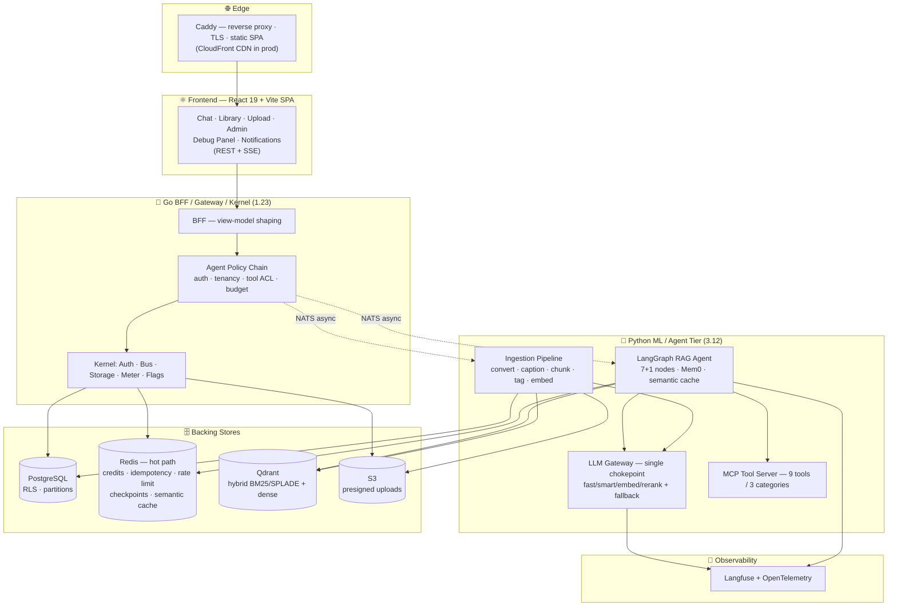
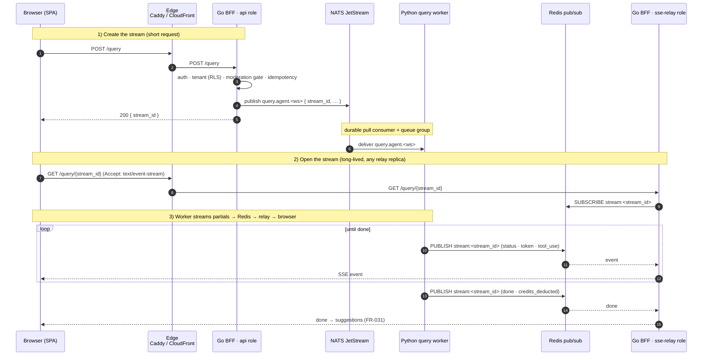
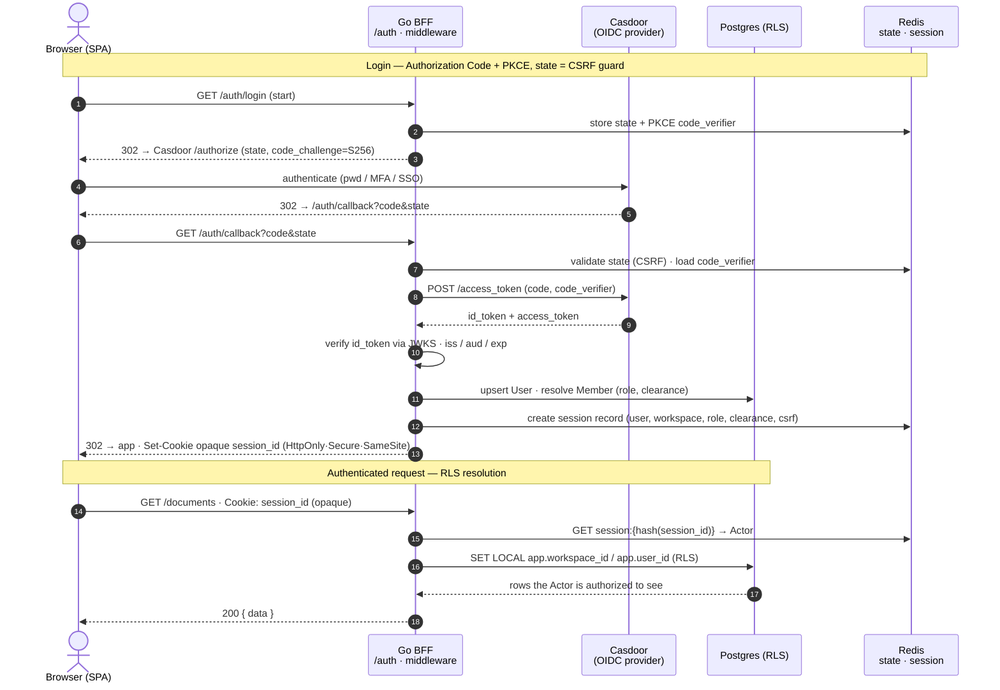

<div align="center">

# 🤖 AISAT-INTEL — ContextEngine

### An AI-Powered Shared Second Brain for Work Teams

**Upload files, paste links, add notes — then ask questions in natural language and get cited, access-scoped answers.**
Access control is enforced at the **data layer**, never by prompt. Every AI operation is **metered, observable, and auditable**.

[](#-technology-stack)
[](#-technology-stack)
[](#-technology-stack)
[](#-architecture-principles)
[](#-security--access-control)
[](#-documentation--artifacts)

</div>

---

## 📖 Table of Contents

- 🎯 [What Is This?](#-what-is-this)
- 🏆 [Why It Is Production-Grade](#-why-it-is-production-grade)
- 🏗️ [System Architecture](#-system-architecture)
- ✨ [Core Capabilities](#-core-capabilities)
- 🧩 [The RAG Agent — 7+1 Node LangGraph](#-the-rag-agent--71-node-langgraph)
- 🔐 [Security & Access Control](#-security--access-control)
- 💳 [Credit Metering & Billing](#-credit-metering--billing)
- ⚡ [Redis — the Production Hot Path](#-redis--the-production-hot-path)
- 🔔 [Notification System](#-notification-system)
- 🔭 [Observability](#-observability)
- 🛠️ [Technology Stack](#-technology-stack)
- 📐 [Architecture Principles](#-architecture-principles)
- 📂 [Repository Structure](#-repository-structure)
- 📚 [Documentation & Artifacts](#-documentation--artifacts)
  - 📜 [Contracts (contract-first boundaries)](#-contracts-contract-first-boundaries)
- 📐 [Diagrams](#-diagrams)
- 🎨 [UI / Design System](#-ui--design-system)
- 🗺️ [Roadmap](#-roadmap)

---

## 🎯 What Is This?

**AISAT-INTEL (ContextEngine)** is a multi-tenant, AI-powered knowledge platform. Team members ingest documents (PDF, DOCX, markdown, images) and web links; the system converts, auto-tags, chunks, embeds, and indexes them. A **stateful RAG agent** then answers natural-language questions **with citations**, strictly scoped to what the requester is cleared to see.

> A shared AI-powered second brain — upload files, paste links, add notes; query across personal + team knowledge; **only ever see what you're allowed to see.**

**Where it is going.** The end state is an **enterprise second brain**: one authoritative, access-governed place where both people *and* AI agents look things up, contribute back, and are held accountable for what they did. Phase 1 builds the substrate — ingest → retrieve → cited answer, with access enforced at the data layer and every AI call metered. Phase 2 adds the layer that makes it enterprise-grade for agents: typed artifacts, a provenance-carrying knowledge graph, a second (group ACL) access axis, an organization above workspace, and **agents as first-class principals bounded by their owner**. Phase 3 makes it trustworthy over time: agents that know the *business* scope they operate in, knowledge that is measured and re-certified rather than merely accumulated, and the compliance commitments an enterprise review asks for. See the [Roadmap](#-roadmap) and [draft-plan.md](specs/draft-plan.md).

**A deliberate secondary property** — because the architecture should be legible, not a black box: every advanced pattern here — hybrid retrieval, cross-encoder reranking, structure-aware **parent-child + contextual-retrieval chunking**, metadata pre-filtering, two-tier tools, visual captioning, and Redis semantic answer-caching — is **named, observable, and visible in a debug panel**. That makes the repo readable as a reference implementation, but the debug panel is a product feature (US5), not the point of the product.

📄 Full specification: [specs/001-contextengine-mvp/spec.md](specs/001-contextengine-mvp/spec.md)

---

## 🏆 Why It Is Production-Grade

This is not a toy RAG demo. It is designed around the constraints real production AI systems must satisfy:

| Concern | How AISAT-INTEL Solves It |
|---|---|
| 🔐 **Hard multi-tenant isolation** | PostgreSQL **Row-Level Security (RLS)** + Qdrant **payload pre-filters**. 100% access-control correctness is a **release blocker** (SC-001). |
| 🛡️ **Prompt-injection resistance** | Access enforced at the data layer, *never* by prompt. Injection / disallowed inputs are **refused before retrieval or spend** (SC-007). Embedded "ignore previous instructions" in documents is treated as inert reference text. |
| 💸 **Exact cost accounting** | Redis hot-path credit ledger + PostgreSQL durable ledger with **idempotency keys** — no double-charge (SC-006), rehydrate-on-cold-start + hourly reconciliation. |
| ⚡ **Performance budgets** | API **p95 < 200ms** (non-LLM paths); retrieval `recall@10 ≥ 0.85`, `MRR@10 ≥ 0.70`; first upload → cited answer **< 5 min**. |
| 🔌 **Vendor resilience** | All LLM access funneled through a **single gateway** with `fast`/`smart`/`embed`/`rerank` aliases and **one-hop provider fallback** — a single-vendor outage degrades, never downs, the product. |
| 🔭 **Full observability** | Langfuse + OpenTelemetry tracing; a per-answer **debug panel** exposes intent, tool, index tier, access-filter result, rerank scores, model, tokens, and credits. |
| 🧪 **Verifiable quality** | **TDD is NON-NEGOTIABLE**; contract-first boundaries; **Testcontainers** for real-infra integration tests; **Playwright** E2E; 80% coverage floor per runtime; a hard access-filter assertion in the eval seed set. |
| 📈 **Scalability** | Stateless Go BFF replicas, horizontally-scaled Python worker pods per NATS subject, partitioned Postgres, Redis hot path, hybrid-vector Qdrant. |

Governed by a formal, versioned **[Project Constitution v2.1.0](.specify/memory/constitution.md)** with ten core principles — every plan must pass a **Constitution Check gate** before implementation (see the gate table in [plan.md](specs/001-contextengine-mvp/plan.md)).

---

## 🏗️ System Architecture

A **three-runtime system** coordinated over NATS, with a single LLM chokepoint and data-layer access control.



**Coordination seams**
- **NATS** is the async bus between Go and Python (ingestion / query / billing subjects).
- **Redis** is the low-latency control plane: credit fast-path, idempotency guards, rate limits / quotas, security throttling, LangGraph checkpoints, semantic answer-cache, and the outbox queue (see [Redis — the Production Hot Path](#-redis--the-production-hot-path)).
- **The LLM Gateway** (`llm_gateway.py`) is the *only* place model IDs exist — business code uses aliases.
- **The MCP server** is the *only* tool surface — every dispatch is allowlist-checked.

#### One Python codebase, many worker roles

The `ingest` / `query` / `crawl` / `email` workers in the diagram are **not** separate repositories — they are logical roles inside the single `backend-python/` codebase (one image, one `pyproject.toml`). **The split happens at the deployment layer, not the code layer:** the same image is deployed as multiple pods, each with an entrypoint that subscribes to a different **NATS subject**.

```text
                       ┌──────────────────────────────┐
                       │   backend-python/  (1 image) │
                       │   shared code · schemas ·    │
                       │   LLM gateway · MCP server   │
                       └──────────────┬───────────────┘
            same image, different entrypoint per subject
        ┌───────────────┬─────────────┴───────┬───────────────┐
   ingestion.*       query.*             billing.*         (crawl)
   ┌────────┐       ┌────────┐          ┌────────┐        ┌────────┐
   │ ×3 pod │       │ ×3 pod │          │ ×3 pod │        │ ×N pod │
   └────────┘       └────────┘          └────────┘        └────────┘
```

| | |
|---|---|
| **What it gives you** | Independent horizontal scaling + per-subject failure isolation, while every role shares the same code, schemas, LLM gateway, and MCP server. |
| **What pattern it is** | A **modular monolith / distributed-worker** model — same family as Celery/Sidekiq queue-scoped workers or NATS/Kafka consumer groups ("one codebase → N specialized consumer deployments"). |
| **Why this middle ground** | It sits between a do-everything monolith (can't scale roles independently) and a repo-per-service split (schema/version-skew tax). |
| **Tradeoffs to manage** | Set **per-role resource limits & autoscaling** (ingest/crawl are bursty; query is latency-sensitive), and keep dependency hygiene tight since all roles share one image. A genuinely divergent role (headless-browser crawl, or a future audio worker) is the natural candidate to peel into its own image later — the per-subject consumer boundary makes that a low-friction refactor. |

📐 Full architecture diagram: [system-architecture.excalidraw](specs/001-contextengine-mvp/diagrams/system-architecture.excalidraw)

#### One Go image, three deployable roles (`api` / `sse-relay` / `worker`)

The Go BFF follows the **same one-image / many-roles** model as the Python tier — the split is at the **deployment layer, not the code layer**. A single `backend-go/` image ships **three entrypoints** that share all `internal/` code, auth, the Redis pub/sub client, and the SSE event contract:

| Entrypoint | Role | Handles | Scales on |
|---|---|---|---|
| `cmd/api/main.go` | **`api`** | REST aggregation + **stream creation** (`POST /query` → publishes to JetStream, returns `stream_id`) | RPS / CPU |
| `cmd/relay/main.go` | **`sse-relay`** | The long-lived streaming `GET`s (`/query/{streamId}`, `/ingest/{jobId}/status`, `/notifications/stream`) | **active connection count** |
| `cmd/worker/main.go` | **`worker`** | Background/scheduled work — outbox drain, reconcile, DLQ sweeps, matview refresh — consumed from JetStream queue groups, triggered by external `*.tick`/`*.refresh` (no in-process timers) | consumer lag |

```text
                        ┌──────────────────────────────┐
                        │   backend-go/  (1 image)     │
                        │   shared internal/ · auth ·  │
                        │   Redis pub/sub · SSE contract│
                        └──────────────┬───────────────┘
              same image, different entrypoint per role
                ┌─────────────────────┴─────────────────────┐
          cmd/api/main.go                            cmd/relay/main.go
          ┌──────────────┐                           ┌──────────────┐
          │ api  · ×N pod│                           │ sse-relay·×M │
          │ REST + POST  │                           │ long-lived   │
          │ stream create│                           │ SSE GETs     │
          └──────────────┘                           └──────────────┘
            scale on RPS/CPU                       scale on connections
```

> **Why this works with zero stickiness:** the relay subscribes to **Redis pub/sub keyed by `stream_id`** — not in-process worker output — so **any `sse-relay` replica can serve any stream**. Phase 1 MAY co-deploy both roles as one process (`ROLE=all`); Phase 4 deploys them as **independently-scaled** services without touching handler code (locked seam — see [research §14](specs/001-contextengine-mvp/research.md)).

> **Why scheduled work lives in `worker`, not `api`:** background loops embedded in a request-serving tier multiply with replicas — a “single hourly reconcile” silently becomes N concurrent reconcilers once `api` autoscales. Instead, a pluggable scheduler (k8s `CronJob`, DigitalOcean App Platform scheduled component, a plain `cron`/systemd timer, or a single internal ticker in the one-replica `worker`) emits a JetStream tick (`billing.reconcile.tick`, `agent.janitor.tick`, `usage.matview.refresh`); a **durable queue group delivers each to exactly one `worker`**, and every handler is an **idempotent atomic claim** (conditional `UPDATE` / `SET NX` / atomic pop), so a duplicate delivery or replica overlap produces no duplicate effect — correctness never depends on leader election (locked seam — see [research §15](specs/001-contextengine-mvp/research.md)).

> **Concurrency terms used above** — how two racing workers (or a redelivered event) never produce a duplicate effect:
> - **Atomic claim** — one indivisible step that only a single worker can win, replacing fragile *check-then-act* (two workers can both pass a separate `SELECT` and then both act). The claim *is* the lock.
> - **Idempotent atomic claim** — that claim is also *safe to repeat*: running it again does nothing extra. So 2 racers → one wins, one no-ops; a redelivered event → no-op the second time.
> - **`SET NX`** — Redis "set if not exists": writes a lock key only if absent, so exactly one worker wins the gate. Used by the **reconcile** job (a multi-step scan with no single row to flip) to avoid running the *whole* job twice — `key reconcile:lock:{shard}:{hour}`. It's a throughput gate; `credit_ledger.idem_key UNIQUE` is the final correctness backstop.
> - **`LPOP`** — Redis atomic "pop from list head": only one worker can take a given outbox item, so the credit-outbox drain never double-processes a spend (paired with `idem_key UNIQUE`).
> - **Conditional `UPDATE`** — the **janitor**'s self-gating claim: `UPDATE agent_run SET status='queued' WHERE status='running' AND last_heartbeat_at < $` — only the racer that actually flips `running→queued` re-queues the run; no separate lock needed.

> **The guarantee hierarchy (why this is correct, not just fast):** these mechanisms are deliberately layered, and the ordering is the whole point:
>
> > **Data-layer idempotency (`idem_key UNIQUE`) is the _only_ correctness guarantee. Leases, queue groups, and `SET NX` are throughput optimizations.**
>
> A lot of systems mistakenly treat a distributed lock or a leader election as their correctness boundary — then get burned when a lock TTL expires mid-operation, a GC pause outlives the lease, or a network partition elects two leaders. Here those primitives are explicitly demoted to **performance** (they stop most duplicate work *before* it hits the database), while the actual money-correctness lives in a **database constraint** that physically cannot admit a second row. So even in the worst case — two "leaders", an expired lock, a redelivered tick — the duplicate write is rejected by the ledger itself, not by a timing assumption. Correctness never depends on a clock or a quorum being healthy.
>
> This is exactly why scaling Redis to Sentinel/Cluster doesn't threaten correctness: a `SET NX` lock is **never safe under async-replication failover** (a primary can ACK the lock, die before replicating, and a promoted replica hands the same lock out twice), so the design **never trusts the lock — it puts the invariant in a DB constraint / conditional write (a fencing token)**. A two-leader window from a Redis failover therefore produces **zero** duplicate effects.

#### SSE streaming flow

How a streamed answer travels from request to last token. Note the **two BFF roles** and that creation (`POST`) and streaming (`GET`) are decoupled through JetStream + Redis:



- **Decoupled by design** — the worker never holds the client connection; it only publishes to Redis by `stream_id`. The browser reconnecting to `GET /query/{stream_id}` can land on **any** `sse-relay` replica.
- **Why two transports** — work dispatch (BFF→worker) uses **JetStream** (durable, redeliverable, lag-measurable); the live-token hop (worker→relay→browser) uses **Redis pub/sub** keyed by `stream_id` (ephemeral, fire-and-forget fan-out to an already-connected client). A dropped token is cosmetic — credits/audit/final answer are authoritative in Postgres, not the stream. Replay-on-reconnect, if ever needed, is a Redis Stream (`XADD`/`XREAD`), not JetStream.
- **Moderation short-circuits before spend** — an injection/disallowed input emits a single `error` event and **no** `token`/`done`, with zero credit spend (SC-007).
- 📐 Event taxonomy + stream contract: [contracts/sse-events.md](specs/001-contextengine-mvp/contracts/sse-events.md) · SSE streaming sequence: [sse-streaming-sequence.excalidraw](specs/001-contextengine-mvp/diagrams/addition/sse-streaming-sequence.excalidraw)

### Go BFF middleware chain

Every request flows through an ordered Go middleware chain before reaching a feature handler — this is where most of the cross-cutting safety guarantees are enforced, not in the handlers:

```text
recover → request-id / trace → auth (JWT or device PAT) → tenant (SET LOCAL app.workspace_id + app.user_id)
       → rate limit → body-size guard (413) → idempotency → policy chain (tool ACL · token budget · credit deduct) → handler
```

- **Tenant middleware** resolves `workspace_id` from the JWT/PAT (never the request body) and runs `SET LOCAL app.workspace_id` / `app.user_id`, so **PostgreSQL RLS applies to every query in the request transaction** — the foundation of multi-tenant isolation.
- **Auth / Actor** resolves the caller (browser JWT or local-agent PAT) into a typed `Actor`; cross-workspace/cross-clearance lookups return `not_found`, never `forbidden`.
- **Idempotency** turns any credit-affecting call carrying an `Idempotency-Key` into a safe replay (SC-006).
- **Body-size guard** rejects oversize requests with `413` at the edge — defense-in-depth against resource exhaustion (including on the OpenAI-compatible `/llm/proxy`).
- **Policy chain** (for agent/proxy routes) enforces the per-role tool allowlist, token budget, and credit deduction before any downstream LLM/tool call.
- **request-id / recovery / trace** stamp a correlation ID, recover panics into the unified error envelope, and start the OpenTelemetry span.

Shared middleware lives in `backend-go/internal/shared/middleware/`; the **kernel never imports product code** (depguard-enforced), keeping these guarantees reusable.

---

## ✨ Core Capabilities

| Capability | Description |
|---|---|
| 📥 **Multi-modal ingestion** | PDFs, DOCX, images, markdown, and any URL — auto-converted, chunked, and indexed with live progress (SSE). |
| 🏷️ **Auto-taxonomy** | Every document is auto-tagged and summarized by a fast LLM step; browse/filter the library by tag. |
| 👥 **Team workspace** | Shared knowledge bases — members query team docs alongside personal knowledge, scoped by a 5-level clearance ladder. |
| 🔐 **Access-controlled AI** | Retrieval scoped at the database layer (RLS + payload filter), never by prompt. |
| 💬 **Conversational agent** | Stateful LangGraph agent routes across personal/workspace knowledge, remembers context via **Mem0**, and explains its reasoning. |
| 🤖 **Long-horizon tasks** | Optional local agents run multi-step tasks (checkpoint-resumable, cancellable, hard per-task cost cap). |
| 💳 **Credit-based billing** | Every AI op (ingest, caption, query, rerank) deducts from a workspace balance in real time. |
| 🔔 **Notifications** | In-app inbox + opt-in email, per-category preferences, recipient-scoped (never leaks across members/workspaces). |
| 🔍 **Observable architecture** | A per-answer debug panel exposes every retrieval/generation step, scores, tokens, and credits. |

📋 Seven prioritized user stories (US1–US8) with acceptance scenarios: [spec.md](specs/001-contextengine-mvp/spec.md)

---

## 🧩 The RAG Agent — 7+1 Node LangGraph

The query path is a stateful LangGraph graph that makes every production RAG pattern explicit and observable:

```mermaid
flowchart LR
    Q["Query"] --> N1["1 · Intent +<br/>injection guard"]
    N1 --> N2["2 · Query rewrite<br/>(smart alias)"]
    N2 --> N3["3 · Hybrid retrieval<br/>BM25/SPLADE + dense"]
    N3 --> N4["4 · Access filter +<br/>cross-encoder rerank"]
    N4 --> N5["5 · Mem0 memory<br/>injection"]
    N5 --> N6["6 · Parent-child<br/>chunk expansion"]
    N6 --> N7["7 · Generate +<br/>cite (semantic cache)"]
    N7 --> N8["8 · Suggested<br/>follow-ups"]
    N8 --> A["Cited answer + debug trace (SSE)"]
```



Patterns shipped: **hybrid search**, **cross-encoder reranking**, **structure-aware parent-child + contextual-retrieval chunking**, **metadata pre-filtering**, **two-tier tools** (knowledge + structured), **visual captioning** for images/diagrams, and a **Redis semantic answer-cache**. Retrieval is served directly from Qdrant — fast enough under load that a separate hot/cold chunk tier is unnecessary; the real latency/cost win comes from caching whole *answers* (see below), not from tiering the vector store. Cross-clearance cache safety is guaranteed by keying any cached answer on `workspace + requester clearance + authorized document set`.

📐 Agent diagram: [langgraph-rag-agent.excalidraw](specs/001-contextengine-mvp/diagrams/langgraph-rag-agent.excalidraw) · Query DFD: [query-path-dfd.excalidraw](specs/001-contextengine-mvp/diagrams/query-path-dfd.excalidraw)

### Production RAG design patterns (and where each lives)

These are the patterns mature AI teams converge on for enterprise RAG — each is a deliberate, observable choice here, not an accident:

| Pattern | Industry practice it mirrors | Where it lives |
|---|---|---|
| **Hybrid retrieval** (sparse + dense) | BM25/SPLADE fused with dense vectors (Glean, Vespa, Azure AI Search) | `retrieval/hybrid.py` — two clearance-scoped Qdrant searches, **RRF**-fused |
| **Retrieve → rerank cascade** | Cheap recall stage + cross-encoder precision stage | `rerank` alias (Cohere → BGE); budgets `recall@10 ≥ 0.85` → `recall@5 ≥ 0.80` post-rerank |
| **Query rewriting** | Rewrite-retrieve-read / multi-query | Node 2 (`smart` alias) before any retrieval |
| **Structure-aware chunking** | Split on document structure, never mid-sentence | `ingestion/chunker.py` — headings/paragraph/sentence boundaries |
| **Parent-child ("small-to-big")** | Embed a precise unit, expand to a complete one for generation | child 200 tok (searched) → parent 1000 tok (sent to LLM) via `parent_doc_id` |
| **Contextual retrieval** | Anthropic-style per-chunk situating prefix to lift recall | flag-gated `chunking.contextual_prefix` (`fast` alias, per-doc summary reused) |
| **Metadata pre-filtering** | Filter *before* vector scoring, not after | Qdrant payload filter on `workspace_id`/`user_id`/`access_level` (also the SC-001 guard) |
| **Semantic router** | Intent classification → cheapest correct path | Node 1 routes `semantic` / `structured` / `long_horizon` |
| **Parameterized tools over Text-to-SQL** | Hand-written scoped queries, never free-form SQL | Tier-2 MCP tools (`query_employees`/`query_projects`/`query_metrics`) |
| **Conversational memory** | Per-user memory layer with recall scoping | Mem0 at Node 5 (clearance-stamped, demotion-safe) |
| **Semantic answer-cache** | Cache whole answers, not just chunks | Redis, keyed by `workspace + clearance + authorized doc set` |
| **Grounded generation + citations** | Eval-gated faithfulness (MRR/recall/citation accuracy) | Node 7 + `evals/run.py` gate (Ragas/DeepEval/Promptfoo) |
| **Stateful, durable orchestration** | Checkpointed graph that survives interruption | LangGraph + Redis checkpoints (long-horizon `agent_run`) |
| **Full LLMOps observability** | Trace every step, score, token, credit | Langfuse + OpenTelemetry + per-answer debug panel |

> **Planned (Phase 2) — answer groundedness & self-correction.** The Phase-1 graph is deterministic and linear by design (a release-blocking posture for access-control + refuse-before-spend). A **CRAG-style** ("Corrective RAG") groundedness node — grade retrieval relevance, then re-retrieve / route to `web_search` (per-search HITL) / **abstain** rather than answer from weak context — plus an optional Self-RAG faithfulness check, slot in as a **single additive node** between rerank/expand and generate. The graph and the `web_search` seam are built in Phase 1 so this is no refactor (research §17).

### Intent routing (the semantic router)

Before any retrieval, **Node 1 classifies the query's intent** and routes it down the cheapest correct path — a *semantic router*, not a one-size-fits-all RAG pipeline. The classified intent is surfaced on the SSE stream and in the debug panel:

| Intent | Routes to | Why |
|---|---|---|
| `semantic` | **Tier 1** knowledge tools — hybrid vector retrieval + rerank over Qdrant | Free-text questions answered from ingested documents with citations |
| `structured` | **Tier 2** fixed, parameterized MCP tools (`query_employees` / `query_projects` / `query_metrics`) | Operational-data questions answered by hand-written scoped SQL — **never** free-form Text-to-SQL (FR-008) |
| `long_horizon` | A durable, checkpointed `agent_run` with a hard per-task credit cap | Multi-step tasks that must survive interruption and be cancellable (US7) |

A key security property rides on this router: **tool results never re-trigger tool calls on their own** — the router always re-derives the next step from the *original classified intent*, not from (untrusted) tool/document output, closing a prompt-injection escalation path (FR-011, SC-007).

### Semantic answer-caching (the real optimization)

Rather than caching *vector chunks*, the system caches the **final LLM answers** in Redis. An incoming query is normalized and keyed by `sha256(workspace_id | user_id | effective_access_level | model | normalize(query))`; a hit returns the complete cited answer **without embedding, vector search, rerank, or generation** — turning a multi-hundred-millisecond, credit-consuming pipeline into a sub-millisecond lookup. The clearance and authorized-document-set components of the key make a cached higher-clearance answer **un-serveable** to a lower-clearance member (SC-001). This is where the latency and cost savings actually live; Qdrant handles the cache-miss path directly with no intermediate chunk tier.

---

## 🔐 Security & Access Control

Access control is **structural**, enforced at multiple layers — not by trusting the model:

- **PostgreSQL RLS** — every tenant-scoped table carries `workspace_id NOT NULL` with a policy `USING (workspace_id = current_setting('app.workspace_id')::uuid)`, set per-request via `SET LOCAL` by the Tenant middleware.
- **Qdrant payload pre-filters** — retrieval is filtered by `workspace_id`, `user_id`, and `access_level` *before* vectors are scored.
- **5-level clearance ladder** — a member sees their own docs plus shared docs at or below their clearance; an uploader can never set a doc above their own level. *(Phase 1 stores the level as an integer and never persists a level **name**, so Phase 2 adds configurable labels and an orthogonal group axis without a migration — see the [roadmap](#-roadmap).)*
- **Memory access-control invariant** — Mem0 memories carry the clearance of the data that produced them; a memory distilled from a now-restricted doc is never re-injected (survives clearance demotion).
- **Existence privacy** — cross-clearance / cross-workspace lookups return `not_found`, never `forbidden`, so restricted resources aren't probeable.
- **Prompt-injection defense** — disallowed/injection inputs are refused *before* retrieval or credit spend; retrieved documents are treated as inert reference material.

These are aligned with **OWASP Top 10 (2025)** — see the repo-wide [security & OWASP instructions](.github/instructions/security-and-owasp.instructions.md).

#### Authentication flow (OIDC + PKCE)

Browser auth is **OIDC Authorization Code + PKCE (S256)** against **Casdoor**, which sits behind the swappable kernel `Auth` interface (interchangeable with `jwt.Auth` / `workos.Auth`). The BFF verifies the `id_token` via JWKS (`iss`/`aud`/`exp`, pinned algorithm), then issues its **own opaque session token** — a high-entropy random ID in an **HttpOnly · Secure · SameSite** cookie, backed by a **Redis** session record. The cookie carries **no claims** (never the provider token, never `localStorage`), is **revoked instantly** on logout/clearance-change by deleting the Redis key, and forces every request to re-read current role/clearance (so a demotion takes effect immediately). Each request resolves the Actor server-side and pushes tenant + identity into Postgres so **RLS** is the real access boundary:



- **Sign-up** requires a Cloudflare **Turnstile** token and fires `OnSignup` (seed demo doc + 1000-credit grant).
- **Local agents** authenticate with a scoped device **PAT** (user+workspace, 90d, revocable) issued via `POST /devices/authorize`; `workspace_id` comes from the PAT, never the request body (FR-027).

📐 Auth contract + sequences: [contracts/auth-flow.md](specs/001-contextengine-mvp/contracts/auth-flow.md) · OIDC sequence: [auth-oidc-sequence.excalidraw](specs/001-contextengine-mvp/diagrams/addition/auth-oidc-sequence.excalidraw) · device/PAT: [local-agent-flow.excalidraw](specs/001-contextengine-mvp/diagrams/addition/local-agent-flow.excalidraw)

📐 Diagrams: [access-control-isolation](specs/001-contextengine-mvp/diagrams/addition/access-control-isolation.excalidraw) · [mcp-tool-allowlist](specs/001-contextengine-mvp/diagrams/addition/mcp-tool-allowlist.excalidraw) · [llm-gateway-chokepoint](specs/001-contextengine-mvp/diagrams/addition/llm-gateway-chokepoint.excalidraw)

---

## 💳 Credit Metering & Billing

- **Two-tier ledger** — Redis holds the authoritative hot balance; PostgreSQL `credit_ledger` (append-only, partitioned) is the durable mirror.
- **No double-charge** — `UNIQUE (idem_key)` + `Idempotency-Key` header make every credit-affecting call a safe replay (SC-006).
- **Graceful limits** — `402 payment_required` on exhausted balance, `429` on daily/per-user limits, admin-configurable near-limit warning (default 80%).
- **Abuse controls** — stricter new-account / per-IP cumulative ceilings to prevent free-credit farming.
- **Resilience** — Redis loss is rebuilt from the durable ledger before serving; hourly reconciliation corrects drift.

> **The Redis-outbox pattern (why a deduction is never lost or double-charged):** a charge must touch two stores — drop the Redis balance *and* append a Postgres ledger row — but they can't share one transaction. So the hot path does both **Redis** steps atomically (`DECRBY` the balance **+** `LPUSH` a spend intent onto `outbox:{shard}`) and returns immediately, never blocking on Postgres. The single-owner `cmd/worker` then atomically `LPOP`s each intent and writes the durable `credit_ledger` row. Delivery is at-least-once (a crash after `LPOP` just redelivers), and `credit_ledger.idem_key UNIQUE` collapses any retry to **exactly one** row — so enforcement stays sub-ms while accounting stays durable and exactly-once. The `{shard}` key lets Phase 4 run N parallel drainers without double-apply.

```text
HOT PATH (api · per request, sub-ms)          ASYNC DRAIN (cmd/worker · sole ledger writer)
┌─ atomic in Redis ─────────────────┐
│ DECRBY balance:{ws}  cost         │          LPOP outbox:{shard}        ← atomic claim
│ LPUSH  outbox:{shard} {…idem_key} │  ───▶    INSERT INTO credit_ledger  ← idem_key UNIQUE = exactly once
└───────────────────────────────────┘          (crash before INSERT → redelivered, still one row)
        returns now (no Postgres wait)          hourly reconcile = drift backstop
```

> **Why reconciliation is still needed (the outbox isn't enough):** the outbox keeps the **ledger** exactly-once, but the **Redis balance is a fast, mutable, non-durable *copy*** of that ledger — and any live-updated copy eventually drifts from its source: a Redis failover can lose the last few seconds of `DECRBY`s, a compensating `INCR`-back on `402`/`429` can be imperfect, and the async drain means Redis and the ledger are momentarily out of step by design. Cold-start rehydration fixes Redis *at boot*; **hourly reconciliation** keeps it honest *at runtime* — it recomputes `expected = SUM(credit_ledger) + grants`, compares to the live Redis balance, and writes a `reconcile` row to heal any drift. SC-006 requires this: users *see* the fast Redis number but are *billed* from the ledger, so the two must provably stay within tolerance.


> **Phase 1 ships credit *metering*, not payments.** Credits are the single internal unit and the consumption hot path (Redis `DECRBY` + outbox + ledger) is fully implemented now. The fiat **payment/provider layer** — Stripe / Polar / PayPal adapters, checkout, webhooks-as-source-of-truth, subscriptions — is an **additive Phase 2** layer that only converts money → credits; it never changes consumption. `plans` / `subscriptions` exist as stubs in Phase 1. See [draft-plan.md — Phase 2 Billing & Payments](specs/draft-plan.md#phase-2-billing-and-payments) (Phase 2 design draft).

📄 Billing & payments design (Phase 2): [draft-plan.md — Phase 2](specs/draft-plan.md#phase-2-billing-and-payments) · 📐 [credit-metering-swimlane](specs/001-contextengine-mvp/diagrams/credit-metering-swimlane.excalidraw) · [billing-payment-flow](specs/001-contextengine-mvp/diagrams/addition/billing-payment-flow.excalidraw)

---

## ⚡ Redis — the Production Hot Path

Redis is far more than a cache here: it is the **low-latency control plane** for the guarantees a production AI system must enforce on *every* request, before any expensive work happens. Postgres remains the durable source of truth; Redis is the sub-millisecond tier in front of it. A single cluster is **logically partitioned by role** (separate logical DBs + key prefixes) so cache pressure can never evict durable state:

| Role | What Redis does | Eviction / durability |
|---|---|---|
| 💳 **Credit fast-path** | Atomic `DECRBY` on the workspace balance gives sub-ms spend enforcement; an outbox drains to the Postgres ledger | `noeviction` + AOF (durable) |
| 🔑 **Idempotency guard** | `SET NX billing:applied:{idem_key}` makes retries / double-clicks no-ops — no double-charge (SC-006) | `noeviction` + AOF |
| 🚦 **Rate limiting & quotas** | Per-user / per-IP / per-workspace counters and per-user daily budgets gate abuse and runaway cost | `volatile-ttl` |
| 🛡️ **Security enforcement** | Brute-force / login throttling, near-limit (`402`/`429`) decisions, and new-account / per-IP ceilings to stop free-credit farming | `volatile-ttl` |
| 🧠 **Semantic answer-cache** | Caches whole cited answers keyed by `workspace + clearance + authorized doc set` — skips embed/search/generate on a hit (SC-001-safe) | `allkeys-lru` (ephemeral) |
| 🔄 **Agent checkpoints** | LangGraph state is checkpointed to Redis (AOF) so long-horizon tasks resume after interruption | `noeviction` + AOF |
| 📡 **SSE fan-out** | Pub/Sub relays streamed agent tokens Python → Go BFF → browser | transient |
| 📤 **Outbox queue** | Decouples the credit hot-path write from the durable ledger write so deduction + ledger intent stay atomic | `noeviction` + AOF |

> **Why this matters for production:** the credit check, idempotency guard, rate limit, and security throttle all sit on the request's critical path — they must add ~1ms, not ~50ms. Running them in Redis (with the durable ledger/Postgres behind) is what lets the system *refuse-before-spend* and enforce budgets in real time without becoming the bottleneck. The **billing/payment** layer (Phase 2) reuses the very same Redis primitives: a verified webhook grants credits via the same idempotent `idem_key` + outbox path. Role separation (durable vs. ephemeral vs. counters) ensures a cache stampede can never evict a credit balance.

---

## 🔔 Notification System

A fully **event-driven, multi-channel** notification subsystem (US8): any backend event — ingestion done/failed, invite received/accepted/revoked, credit near-limit / exhausted, long-horizon task halted, document shared, clearance changed, new member joined, admin broadcast — fans out to an **in-app inbox** (real-time over SSE) and an **opt-in email** channel, gated by each member's per-category, per-channel preferences. It is designed for the same production properties as the billing path: **exactly-once, recipient-scoped, async, and durable**.

| Property | How it's enforced |
|---|---|
| 🔒 **Recipient-scoped (no leaks)** | Every notification is bound to `(workspace_id, user_id)` and enforced at the **data layer** (RLS: `user_id = current_setting('app.user_id')`). Never visible/delivered to another member or across workspaces, regardless of clearance — a release blocker (FR-036, **SC-012**). |
| 🎯 **Exactly-once delivery** | Each triggering event carries a deterministic `idem_key` derived from the originating resource + event. Redelivery/producer retry yields **at most one** persisted row, one in-app push, one email (FR-032, **SC-013**). |
| ⚡ **Real-time in-app** | The service pushes via Redis pub/sub `notify:user:<id>`; the **`cmd/relay`** SSE tier streams it to the browser and updates the unread count with no reload (FR-034). |
| 📨 **Compliant email** | Provider-agnostic `kernel/mailer.go` port (default Resend, env-swappable) with retry + **DLQ** for exhausted sends; every non-essential email carries an unsubscribe link, and provider **bounce/complaint** webhooks suppress further email to that address (FR-035). |
| ♻️ **DLQ drain + poison cap** | A single-owner `dlq.sweep.tick` job in `cmd/worker` re-drives parked DLQ messages (`ingestion.dlq`, `notify.email.dlq`) back to their owning subject under a backoff; after `MAX_DLQ_ATTEMPTS` a poison message lands in a durable `dead_letters` table with a `dlq.dead.count` alert — *never dropped, never retried forever* (research §18). |
| 📣 **Async broadcast** | Admin broadcast fan-out runs **off the request path** so delivery to a large membership never blocks or times out the admin's request; recorded in the audit trail (FR-037). |
| 🌊 **Storm coalescing** | High-volume same-category bursts (e.g., many ingests finishing at once) collapse into a digest / rate-limited summary instead of one push + email per event (FR-038). |
| 🗄️ **Bounded growth** | Read notifications past the retention window (default 90d) are purged/archived via a scheduled `notify.retention.tick`, range-partitioned by `created_at`, so inbox + unread-count queries stay fast (FR-039). |

> **Where it runs (independent scale-out).** The fan-out consumer (`notify.<ws>`) and the Go **email worker** (`notify.email.<ws>`) are **JetStream queue-group consumers hosted in `cmd/worker`** — N idempotent replicas that scale per-subject on consumer lag, fully independent of the request-serving `api`/`relay` tiers *and* of the single-owner scheduled jobs (`*.tick`/`*.refresh`). The email worker is plain Go (no AI/ML), so it lives in the Go tier on the same `kernel/mailer.go` port the rest of the kernel uses — not in the Python ML tier.

> **Why exactly-once needs two guards (the same defense-in-depth as billing).** The notify handler does more than insert a row — it also pushes in-app (Redis pub/sub) and re-enqueues email, and those side-effects are **not** transactional with the DB write. So a cheap `SET NX notify:applied:{idem_key}` short-circuits the *entire* duplicate handler before any work, while the durable `UNIQUE (user_id, idem_key)` constraint is the permanent backstop that guarantees at-most-one row even if Redis evicted/expired the guard or two replicas raced. Redis = fast early-exit (ephemeral); Postgres UNIQUE = durable proof of SC-013.

```text
PRODUCERS (ingest · billing · invite · agent · admin)
        │  publish notify.<ws> { recipient, category, idem_key, … }
        ▼
notify.<ws> queue group ── cmd/worker (N replicas, idempotent) ──┐
   SET NX notify:applied:{idem_key}   ← fast dup gate            │
   INSERT … UNIQUE(user_id, idem_key) ← durable backstop (SC-013)│
        ├── in-app:  PUBLISH notify:user:<id> ──▶ cmd/relay ──▶ browser (SSE, live unread count)
        └── email?   if pref enabled → notify.email.<ws> ──▶ Go email worker (cmd/worker)
                                                              kernel/mailer.go (Resend) · retry · DLQ
                                                              suppression-list check (bounce/complaint/unsubscribe)

DLQ DRAIN (dlq.sweep.tick · single-owner cmd/worker)
  for each msg in *.dlq.<ws>:
     dlq_attempts < MAX ?  ──yes─▶ re-publish to owning subject (dlq_attempts+1, backoff) ─▶ owning worker reprocesses idempotently
                          └─no─▶ INSERT dead_letters + emit dlq.dead.count (terminal, admin-replayable)
```

📐 Flow diagram: [notification-flow.excalidraw](specs/001-contextengine-mvp/diagrams/addition/notification-flow.excalidraw) · 📄 Subjects: [nats-subjects.md](specs/001-contextengine-mvp/contracts/nats-subjects.md) · UI: [notifications.md](design-system/aisat-intel/pages/notifications.md)

---

## 🔭 Observability

Every answer is fully traceable. The **debug panel** (US5) surfaces, per query: detected intent, tool called, whether a semantic-cache hit served the answer, access-filter summary (how many docs filtered out by clearance), hybrid/rerank scores, chunk expansion, injected memory, model used, token cost, credits deducted — plus a link to the full **Langfuse + OpenTelemetry** trace. LLM call logs (`llm_call_log`) drive the admin cost dashboard; raw prompt/response bodies are retained 30 days, then purged to PII-scrubbed metadata.

---

## 🛠️ Technology Stack

| Layer | Technology |
|---|---|
| **Go BFF / Gateway / Kernel** | Go 1.23 · Gin · GORM · nats.go · go-redis · OpenTelemetry · zerolog · Sentry |
| **Python ML / Agent Tier** | Python 3.12 · FastAPI · LangGraph · Mem0 · BAML · FastMCP · MarkItDown · Crawl4AI · qdrant-client · Langfuse SDK |
| **Frontend** | React 19 · Vite · TypeScript 5.x · native EventSource/SSE · PostHog |
| **Data** | PostgreSQL (RLS) · Redis · Qdrant (hybrid BM25/SPLADE + dense) · S3 |
| **Async / Edge** | NATS · Caddy (reverse proxy + auto TLS) · CloudFront (prod CDN) |
| **Auth** | Casdoor (swappable via kernel `Auth` interface — `jwt.Auth` / `workos.Auth`) |
| **Observability** | Langfuse · OpenTelemetry · Sentry · PostHog |
| **Testing** | `go test` · `pytest` · Vitest · **Testcontainers** · **Playwright** · Promptfoo / DeepEval / Ragas (eval) |

---

## 📐 Architecture Principles

Ten constitutional principles ([constitution.md](.specify/memory/constitution.md), v2.1.0) govern the codebase. Highlights:

1. **Code Quality (NON-NEGOTIABLE)** — zero-error lint/format gate (`golangci-lint`, `ruff`/`black`, `eslint`/`prettier`); complexity ceiling; constants over magic values.
2. **Clean Architecture (layered)** — high-level kernel/product split (`depguard`-enforced) + lower-level **feature-first** modules (`internal/<feature>/{model,dto,errors,service,infra}`).
3. **API-First / Contract-First** — every boundary is a contract before code (REST, NATS, MCP, SSE, LLM gateway).
4. **Modular Design & Feature Flags** — each feature self-wires via `SetupModule(appCtx)`; new behavior gated behind the kernel `Flags` interface.
5. **Testing Standards** — table-driven Go tests, real-infra integration via Testcontainers, contract tests per boundary, Playwright E2E, 80% coverage floor.
6. **Test-Driven Development (NON-NEGOTIABLE)** — Red-Green-Refactor; contracts precede handlers/workers.
7. **Backend for Frontend (BFF)** — Go BFF shapes responses to SPA view-models; holds no core business logic.
8. **UX Consistency** — shared design system, typed SSE taxonomy, canonical `{code,message,details}` error schema, ISO-8601 UTC, integer credits, WCAG 2.1 AA.
9. **Performance Requirements** — explicit budgets; hot/cold routing, payload indexes, RLS, Redis fast path, semantic cache.
10. **Verification Before Completion (NON-NEGOTIABLE)** — work is "done" only with command output as evidence.

---

## 📂 Repository Structure

The full post-implementation layout — a layered **kernel/product** split in Go and **feature-first** modules across all three runtimes (per [plan.md](specs/001-contextengine-mvp/plan.md) and [tasks.md](specs/001-contextengine-mvp/tasks.md)):

```text
aisat-intel/
├── README.md                          # ← you are here
├── Makefile                           # canonical task runner: up/down · build · test · lint · migrate · eval · dev
├── .specify/memory/constitution.md    # 🏛️ governing constitution (v2.1.0)
│
├── backend-go/                        # 🐹 Go BFF · gateway · kernel
│   ├── cmd/api/                       #   main.go (wires platform clients + each feature's SetupModule)
│   ├── cmd/relay/                     #   main.go (SSE-relay role — streaming GETs over Redis pub/sub)
│   ├── cmd/worker/                    #   main.go (background/scheduled role — queue-group consumers, no timers)
│   ├── kernel/                        #   template-level — never imports product (depguard-enforced)
│   │   ├── auth.go bus.go storage.go meter.go flags.go cache.go …
│   │   └── identity/ tenancy/ billing/ notifications/ audit/ files/ observability/ admin/
│   ├── internal/                      #   product tier — feature-first
│   │   ├── platform/                  #     concrete infra: postgres/ redis/ qdrant/ nats/ otel/ logger/
│   │   ├── shared/                    #     cross-cutting: dto/ errors/ middleware/ model/
│   │   ├── workspace/ invite/ credits/ ingest/ query/ notification/ policy/
│   │   │                              #     each: model/ dto/ errors/ service/ infra/{repo/db,transport/http}
│   ├── migrations/                    #   SQL migrations (RLS policies, partitions)
│   └── tests/                         #   contract · integration (//go:build integration, Testcontainers) · e2e
│
├── backend-python/                    # 🐍 ML/AI workers · agent · ingestion · MCP server
│   ├── src/
│   │   ├── routers/                   #   ingest · query · crawl · admin (FastAPI)
│   │   ├── services/
│   │   │   ├── llm_gateway.py         #     single LLM chokepoint (aliases · fallback · budget · trace)
│   │   │   ├── ingestion/             #     pipeline · chunker · captioner · markitdown · crawler · tagger
│   │   │   ├── retrieval/             #     hybrid · reranker · hot_cold · filter
│   │   │   └── agent/                 #     graph (7+1 nodes) · memory (Mem0) · semantic cache · suggestions
│   │   ├── mcp_server/                #   server.py + tools/{knowledge,structured,utility} · billing/ledger.py
│   │   ├── baml_client/               #   generated BAML client
│   │   └── schemas/                   #   ingest · query · agent · billing
│   ├── prompts/                       #   query_rewrite/ · metadata_extract/ · image_caption/ · response_format/
│   ├── evals/run.py                   #   Phase 1 minimal eval runner (Promptfoo/DeepEval/Ragas subset)
│   └── tests/                         #   contract · integration · unit
│
├── frontend/                          # ⚛️ React 19 + Vite SPA
│   ├── src/
│   │   ├── features/                  #   feature-first: chat/ library/ upload/ admin/ workspace/ (components/ hooks/ api/ types/)
│   │   ├── components/                #   shared design-system primitives
│   │   ├── lib/                       #   api.ts · sse.ts
│   │   └── types/                     #   cross-cutting shared types
│   └── tests/                         #   vitest (unit/component) + Playwright (e2e/)
│
├── deploy/
│   ├── docker-compose.yml             # local dev: postgres · redis · qdrant · nats · casdoor · caddy
│   └── Caddyfile                      # reverse proxy · automatic TLS · static SPA serving
│
├── specs/001-contextengine-mvp/       # 📋 the full design package (source of truth)
│   ├── spec.md                        #   feature spec (US1–US8, FRs, clarifications)
│   ├── plan.md                        #   implementation plan + Constitution Check
│   ├── research.md                    #   Phase 0 research decisions
│   ├── data-model.md                  #   entities, RLS, partitions, invariants
│   ├── quickstart.md                  #   local dev / run guide
│   ├── tasks.md                       #   dependency-ordered task breakdown
│   ├── checklists/requirements.md     #   spec-quality checklist
│   ├── contracts/                     #   📜 contract-first boundaries (REST · NATS · MCP · LLM · SSE)
│   └── diagrams/                      #   📐 Excalidraw architecture diagrams
│
└── design-system/aisat-intel/        # 🎨 UI design system + per-page specs
```

> Runtime trees (`backend-go/`, `backend-python/`, `frontend/`, `deploy/`) are scaffolded by the task plan — see the Project Structure section of [plan.md](specs/001-contextengine-mvp/plan.md) and [tasks.md](specs/001-contextengine-mvp/tasks.md).

---

## 📚 Documentation & Artifacts

This repository is **spec-driven** (GitHub Spec Kit). The design package is the source of truth:

| Artifact | Purpose |
|---|---|
| 🏛️ [constitution.md](.specify/memory/constitution.md) | Ten governing principles; every plan passes a Constitution Check gate. |
| 📋 [spec.md](specs/001-contextengine-mvp/spec.md) | Feature spec — 8 user stories, ~36 functional requirements, success criteria, clarifications. |
| 🗺️ [plan.md](specs/001-contextengine-mvp/plan.md) | Implementation plan, technical context, performance budgets, project structure. |
| 🔬 [research.md](specs/001-contextengine-mvp/research.md) | Phase 0 research and decision rationale. |
| 🗄️ [data-model.md](specs/001-contextengine-mvp/data-model.md) | Entity catalog, RLS policies, partitions, access-control invariants. |
| 🚀 [quickstart.md](specs/001-contextengine-mvp/quickstart.md) | Local development and run instructions. |
| ✅ [tasks.md](specs/001-contextengine-mvp/tasks.md) | Dependency-ordered, TDD-first task breakdown by user story. |
| 💳 [draft-plan.md](specs/draft-plan.md) | Phase 2+ later-phase design notes held for future planning. **Phase 2** (substrate): billing & payments, response rating, workspace mind map, enterprise knowledge layer, tenancy & delegated administration, agent access & accountability. **Phase 3** (trust): agent orientation & business scope, knowledge health, enterprise compliance & data lifecycle, the expression layer. **Phase 4**: scale/resilience hardening. Each section links back to the Phase 1 doc it defers from; Phase 2 decisions are resolved, Phase 3 notes carry their open decisions explicitly. |
| ☑️ [checklists/requirements.md](specs/001-contextengine-mvp/checklists/requirements.md) | Spec-quality checklist. |

### 📜 Contracts (contract-first boundaries)

Source of truth for every system boundary and the target of contract tests — [contracts/README.md](specs/001-contextengine-mvp/contracts/README.md):

| Contract | Surface |
|---|---|
| [bff-rest.md](specs/001-contextengine-mvp/contracts/bff-rest.md) | Go BFF public REST + SSE endpoints |
| [nats-subjects.md](specs/001-contextengine-mvp/contracts/nats-subjects.md) | NATS subject schema (ingestion / query / billing) |
| [mcp-tools.md](specs/001-contextengine-mvp/contracts/mcp-tools.md) | 9 MCP tools across 3 categories |
| [llm-gateway.md](specs/001-contextengine-mvp/contracts/llm-gateway.md) | Python LLM gateway interface, aliases, fallback |
| [sse-events.md](specs/001-contextengine-mvp/contracts/sse-events.md) | SSE event taxonomy (BFF ↔ frontend) |

---

## 📐 Diagrams

Open `.excalidraw` files at [excalidraw.com](https://excalidraw.com) or with the VS Code Excalidraw extension.

**Core**
- [system-architecture](specs/001-contextengine-mvp/diagrams/system-architecture.excalidraw) — the three-runtime topology
- [langgraph-rag-agent](specs/001-contextengine-mvp/diagrams/langgraph-rag-agent.excalidraw) — the 7+1 node agent graph
- [ingestion-pipeline](specs/001-contextengine-mvp/diagrams/ingestion-pipeline.excalidraw) — convert → caption → chunk → tag → embed
- [query-path-dfd](specs/001-contextengine-mvp/diagrams/query-path-dfd.excalidraw) — query data-flow
- [credit-metering-swimlane](specs/001-contextengine-mvp/diagrams/credit-metering-swimlane.excalidraw) — credit deduction lifecycle
- [data-model-er](specs/001-contextengine-mvp/diagrams/data-model-er.excalidraw) — entity-relationship model

**Deep dives** ([diagrams/addition/](specs/001-contextengine-mvp/diagrams/addition/))
- access-control-isolation · mcp-tool-allowlist · llm-gateway-chokepoint · auth-oidc-sequence · billing-payment-flow · sse-streaming-sequence · nats-subject-topology · notification-flow · local-agent-flow

---

## 🎨 UI / Design System

A dark-first developer/observability aesthetic — *"code dark + run green"* (slate-900 canvas, run-green primary, semantic cyan/amber/red for status and scores), with Fira Code / Fira Sans typography and WCAG 2.1 AA targets.

- 🎨 Master tokens & components: [design-system/aisat-intel/MASTER.md](design-system/aisat-intel/MASTER.md)
- 📄 Per-page specs: [chat](design-system/aisat-intel/pages/chat.md) · [library](design-system/aisat-intel/pages/library.md) · [workspace](design-system/aisat-intel/pages/workspace.md) · [agents](design-system/aisat-intel/pages/agents.md) · [credits](design-system/aisat-intel/pages/credits.md) · [notifications](design-system/aisat-intel/pages/notifications.md) · [admin](design-system/aisat-intel/pages/admin.md) · [organization](design-system/aisat-intel/pages/organization.md) *(Phase 2)*
- 🖼️ Rendered mockups live in [`.stitch/designs/`](.stitch/designs/) — one HTML file per page spec. Future-phase affordances are staged there behind a muted `Phase 2` / `Phase 4` chip so shipped Phase-1 surface stays distinguishable from design intent.
- 🔧 The shared app shell (sidebar, org/workspace switcher, primary nav) is generated for every mockup by [`.stitch/build.py`](.stitch/build.py) — edit it there, not per file. `python3 .stitch/build.py --check` fails on drift.

---

## 🗺️ Roadmap

| Phase | Scope |
|---|---|
| **Phase 1 — Core App** *(current)* | Ingestion, 7-pattern RAG, agent layer, access control, credits, debug panel, notifications — plus structural prompt-injection defenses and a minimal eval seed set. |
| **Phase 2 — Evaluation Suite & Billing** | Full Promptfoo + DeepEval + Ragas, **answer-groundedness self-correction** (CRAG/Self-RAG node — grade → re-retrieve / `web_search` / abstain, see [research §17](specs/001-contextengine-mvp/research.md)), agent `web_search` (per-search HITL), context compression (Headroom seam), audio ingestion (Whisper), the **billing & payments** layer (Stripe / Polar / PayPal adapters, checkout, webhooks, subscriptions — see [draft-plan.md — Phase 2](specs/draft-plan.md#phase-2-billing-and-payments)), **AI response rating** (thumbs up/down per answer, feeds eval pipeline — see [draft-plan.md](specs/draft-plan.md#phase-2--ai-response-rating-thumbs-up--down)), and a **workspace knowledge mind map** (seed from any doc/note/query, edge-verified retrieval, progressive SSE streaming — see [draft-plan.md](specs/draft-plan.md#phase-2--workspace-knowledge-mind-map)). |
| **Phase 2 — Enterprise & Access** | A second **access axis** — the L1–L5 ladder joined by group/principal ACLs, with the ladder's labels and level count becoming workspace config (see [draft-plan.md — Access model](specs/draft-plan.md#access-model-decided)); an **enterprise knowledge layer** (typed artifacts, a provenance-carrying knowledge graph, an agent registry, and Git/Jira/Confluence connectors — [draft-plan.md](specs/draft-plan.md#phase-2--enterprise-knowledge-layer-typed-artifacts-knowledge-graph--agent-context-api)); an **organization** above workspace for consolidated billing, SSO/SCIM and policy defaults, plus delegated group administration ([draft-plan.md](specs/draft-plan.md#phase-2--tenancy--delegated-administration)); and **agent access & accountability** — agents as principals bounded by their owner, explicit write scope, and resource-level audit visible to the agent's owner ([draft-plan.md](specs/draft-plan.md#phase-2--agent-access--accountability)). |
| **Phase 3 — Trust & Knowledge Health** | Makes the Phase 2 substrate trustworthy and self-maintaining. **Agent orientation & business scope** — a bounded, per-caller `get_workspace_context` briefing (charter, domain map, governing rules, the agent's *own* effective scope) plus a `list_changes` cursor, so an agent knows what the organization does instead of only what it may read ([draft-plan.md](specs/draft-plan.md#phase-3--agent-orientation--business-scope)). **Knowledge health** — lifecycle-aware retrieval ranking (deprecated/stale/superseded demoted, not just badged), knowledge-usage telemetry with a coverage-gap backlog, and steward-driven recertification prioritized by what is actually load-bearing ([draft-plan.md](specs/draft-plan.md#phase-3--knowledge-health-lifecycle-aware-retrieval-usage-telemetry--recertification)). **Enterprise compliance & data lifecycle** — provable erasure across every derived store, per-workspace provider/residency policy at the LLM gateway, SIEM audit export, legal hold, access recertification, and isolation tiering ([draft-plan.md](specs/draft-plan.md#phase-3--enterprise-compliance--data-lifecycle)). **The expression layer** — grounded drafting, decision records, and change digests, so the corpus produces artifacts and not only answers ([draft-plan.md](specs/draft-plan.md#phase-3--the-expression-layer)). Plus **automated red-teaming** (NVIDIA Garak), principal anomaly detection, and expanded abuse controls. |
| **Phase 4 — Scale & Resilience** | Worker autoscaling (KEDA on NATS lag), SSE connection ceilings and backpressure, PgBouncer, Qdrant/Redis HA, load & soak testing, per-tenant fairness — [draft-plan.md — Phase 4](specs/draft-plan.md#phase-4-scalability-and-resilience-hardening). |

---

<div align="center">

**Built spec-first.** Governed by a [constitution](.specify/memory/constitution.md). Verified by evidence.

*Access enforced at the data layer · Every AI call metered · Every answer observable.*

</div>
