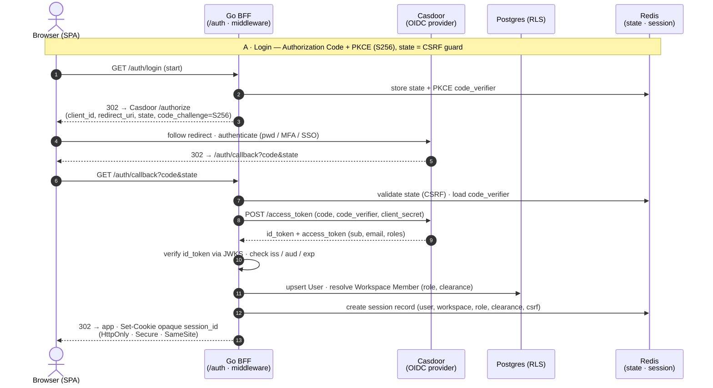
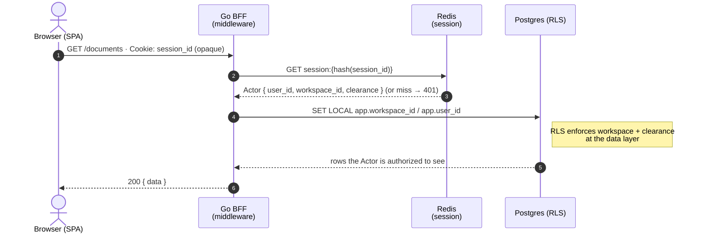
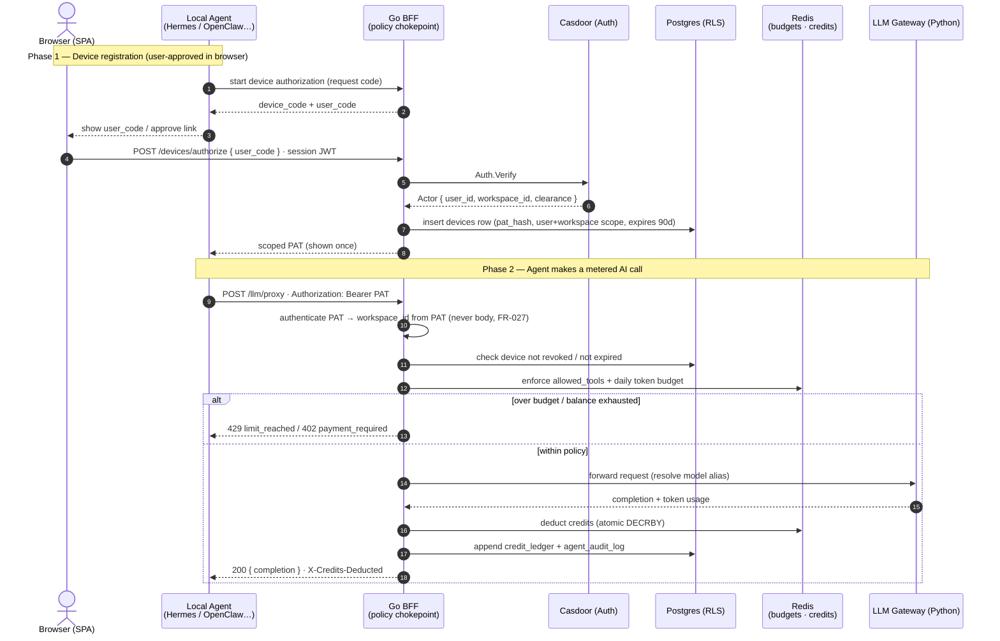

# Contract: Authentication & Session Flow

**Plan**: [../plan.md](../plan.md) | **REST surface**: [bff-rest.md](./bff-rest.md) | **Diagram**: [auth-oidc-sequence.excalidraw](../diagrams/addition/auth-oidc-sequence.excalidraw)

Authentication is provided through the swappable kernel `Auth` interface (`backend-go/kernel/auth.go`). The Phase-1 deployment implements it with **Casdoor** (`backend-go/kernel/identity/casdoor/auth.go`), interchangeable with `jwt.Auth` / `workos.Auth` — product code never imports the provider directly. The browser uses **OIDC Authorization Code + PKCE**; local agents use **scoped PATs**.

## Invariants

- **Identity is always resolved server-side from a verified token** (opaque session cookie for browsers, PAT for agents). `workspace_id`, `user_id`, and clearance are **never** read from the request body (FR-004, FR-027).
- **Casdoor sits behind the kernel `Auth` interface.** The BFF calls `Auth.Verify` / the OIDC code exchange; swapping the provider changes one adapter, not product code.
- **PKCE (S256) + `state`** protect the public SPA client against code interception and CSRF (security: AU7/AU8).
- The BFF **verifies the `id_token` via Casdoor JWKS** and checks `iss` / `aud` / `exp` before trusting any claim (AU1); the algorithm is pinned (no `alg:none`).
- **The browser session is an opaque reference token** — a high-entropy random session ID in an **HttpOnly, Secure, SameSite** cookie. It carries **no claims**; the BFF looks it up in **Redis** on every request to load the session record. Never the provider token, never `localStorage` (AU3/FE6/EX3).
- **Casdoor's `id_token` / `access_token` never reach the browser.** They are used transiently on the backend during the code exchange and discarded; only the server-side session record persists (in Redis).
- After authentication the request runs through Auth + Tenant middleware, which sets `SET LOCAL app.workspace_id` / `app.user_id` so **Postgres RLS** is the actual access-control boundary (not application code or prompt text).

## Session model — opaque reference token (not stateless JWT)

The session cookie value is an **opaque, unguessable session ID** (e.g. 256-bit CSPRNG), not a signed JWT. The authoritative session record lives **server-side in Redis**, keyed by a hash of the session ID:

- **Stored in Redis** (`session:{sha256(session_id)}`): `user_id`, `workspace_id`, `role`, `clearance`, `created_at`, `last_seen_at`, absolute + idle expiry, and a `csrf_token`. The cookie itself holds **only** the random ID.
- **Revocation is immediate** — `/auth/logout` (and admin force-logout / clearance change) deletes the Redis key, so the very next request is unauthenticated. This is the main reason for choosing opaque over stateless: a stateless JWT can’t be revoked before its `exp` without a separate denylist, which re-introduces the server-side lookup anyway.
- **No claims on the wire** — the token leaks nothing if intercepted, and clearance/role can’t go stale in the client (every request re-reads the current values from Redis, so an L4→L2 demotion takes effect instantly).
- **Rotation** — the session ID is rotated on privilege change (re-auth, clearance change) to limit fixation; idle TTL is refreshed on use up to the absolute lifetime.
- **CSRF** — `SameSite` is the first line; for state-changing requests the BFF also checks the per-session `csrf_token` (double-submit) since the cookie is sent automatically.

> Trade-off accepted: every authenticated request costs one Redis lookup (a sub-millisecond `GET` on the same Redis already in the hot path for credits/cache). In exchange we get instant revocation, no stale-claim risk, and a zero-information cookie. Stateless JWTs are still available behind the same kernel `Auth` interface (`jwt.Auth`) if a future deployment needs to drop the lookup.

## A. Browser login — OIDC Authorization Code + PKCE

> **Sign-up** (`POST /auth/signup`) creates the account + workspace, requires a Cloudflare **Turnstile** token (FR-020), and fires the `OnSignup` hook (seed demo doc + 1000-credit grant). It then lands the user in the same authenticated session as the flow above.

## B. Authenticated request — RLS resolution

Every authenticated call resolves the Actor from the opaque session cookie (Redis lookup) and pushes tenant + identity into the Postgres session so RLS scopes every query in the request transaction.

## C. Local agent — device authorization + scoped PAT

Two phases: a browser-approved device registration that mints a scoped PAT, then the agent using that PAT through the `/llm/proxy` policy chokepoint. (Full tool/credit path: [local-agent-flow.excalidraw](../diagrams/addition/local-agent-flow.excalidraw).)

- PAT is scoped to `user + workspace`, **90-day** expiry, rotatable, revocable from the UI (`devices` table, FR-025).
- BYOK mode (admin-toggleable per workspace) MAY bypass *AI-token* metering but MUST still route **workspace tool calls** through the server (FR-026).

## Endpoints (kernel)

| Method | Path | Purpose | Notes |
|--------|------|---------|-------|
| GET | `/auth/login` | Begin OIDC Authorization Code + PKCE | Stores `state` + `code_verifier` in Redis; 302 → Casdoor `/authorize` |
| GET | `/auth/callback` | OIDC redirect handler | Validates `state`, exchanges `code` + `code_verifier`, verifies `id_token` (JWKS), creates Redis session + sets opaque session cookie |
| POST | `/auth/signup` | Create account + workspace | Turnstile token required (FR-020); fires `OnSignup` (demo doc + 1000-credit grant) |
| POST | `/auth/logout` | Invalidate session | Deletes the Redis session record + clears the cookie (immediate revocation) |
| POST | `/auth/password-reset` | Request/confirm reset | Delegated to the provider where applicable |
| POST | `/devices/authorize` | Approve a device (browser) | Issues scoped PAT (user+workspace, 90d) (FR-025) |
| GET / DELETE | `/devices` · `/devices/{id}` | List / revoke connected devices | FR-025 |

---

## Deferred to project Phase 2 (out of scope here)

> Note: the "Phase 1 / Phase 2" labels inside the sequence diagram above are the two **steps of
> the device flow** (registration, then a metered call) — not project phases. This section is
> about the project phase.
>
> Out of Phase 1 scope (see [spec.md](../spec.md) "Out of Scope"); designed in
> [draft-plan.md — Agent Access & Accountability](../../draft-plan.md#phase-2--agent-access--accountability).
>
> **An agent becomes its own principal.** In Phase 1 a scoped PAT carries the registering
> member's access, so an agent that needs L2 inherits its owner's L5. Phase 2 gives the agent
> its own clearance and group grants, resolved at token-mint as `min(agent, owner)` for
> clearance and the intersection for groups — so demoting the owner or revoking their group
> removes the agent's access on its next token, with no cleanup job. The PAT flow above is
> otherwise unchanged.
