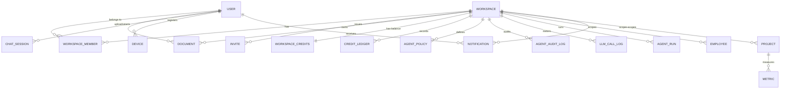

# Phase 1 Data Model: AISAT-STUDIO MVP (Phase 1)

**Date**: 2026-06-06 | **Plan**: [plan.md](./plan.md) | **Spec entities**: see [spec.md](./spec.md) Key Entities

All primary keys are UUID v7 (time-sortable). All tenant-scoped tables carry `workspace_id NOT NULL` and a PostgreSQL RLS policy (`USING (workspace_id = current_setting('app.workspace_id')::uuid)`) set by the Tenant middleware via `SET LOCAL app.workspace_id`. Tables noted as partitioned use `PARTITION BY RANGE (created_at)` (or the noted column); expiry is a partition `DROP`. Soft delete via `deleted_at` where noted.

Layer legend: **K** = kernel (template-level, reusable across products) · **P** = product (ContextEngine-specific).

## Entity catalog

### User (K)
The authenticating person.
- `id`, `email` (unique), `password_hash`, `email_verified_at`, `mfa_enabled`, `created_at`, `updated_at`, `deleted_at`
- Rules: email unique; `email_verified_at` gates relaxed new-account budgets (FR-020).

### Workspace (K)
The tenant boundary and unit of isolation.
- `id`, `slug` (unique), `name`, `tenant_id`, `owner_id` → User, `created_at`, `updated_at`, `deleted_at`
- Config (via `product.config.yaml` / settings): `warning_threshold_pct` (default 80, FR-017), `max_upload_bytes` (default 52428800 = 50 MB, FR-003), `default_access_level`, `byok_enabled` (admin toggle, FR-026).
- Rules: complete isolation — no cross-workspace visibility (FR-014, SC-001).

### Workspace Member (K)
Association of a User to a Workspace.
- PK (`workspace_id`, `user_id`); `access_level` INT (1–5), `role` (`owner`|`admin`|`member`), `status` (`active`|`invited`|`suspended`), `invited_by`, `joined_at`
- Rules: `access_level` ∈ [1,5] (Clarification Q1); a member sees own docs + shared docs at ≤ their level (FR-007, FR-013); only owner/admin manage membership (FR-015).

### Invite (K)
Pending, revocable invitation.
- `id`, `workspace_id`, `email`, `role`, `clearance`/`access_level`, `token_hash`, `expires_at`, `accepted_at`, `created_by`
- Rules: revocable; accept assigns role + clearance (FR-015, US3-AS3).

### Document (P)
An ingested unit of knowledge. Partitioned by `created_at`.
- `id`, `workspace_id`, `user_id` (owner), `s3_key`, `source_type` (`pdf`|`docx`|`markdown`|`image`|`note`), `tags[]`, `summary`, `data_type`, `access_level` INT (1–5), `scope` (`personal`|`workspace`), `created_at`, `updated_at`, `deleted_at`
- A **note** is a Document with `source_type='note'` (see Note below); it inherits all security/clearance/RLS/embedding behavior — no parallel entity. `crawl` is no longer a user-facing `source_type`; web crawling is now an internal fetch step of note enrichment (FR-001).
- Security fields (`workspace_id`, `user_id`, `tenant_id`, `access_level`) are stamped server-side from the authenticated upload context — never model-inferred (FR-004/FR-005). `access_level` defaults to the uploader's own clearance when unset (Clarification Q1) and may never exceed it.
- State transitions (ingestion status, tracked on the ingestion job / SSE, not necessarily a column): `received → converting → extracting_metadata → chunking → embedding → indexed` | `unsupported_type (501 stub)` | `rejected_oversize` | `dlq_parked` (embed-provider outage) | `failed`.

### Note (P) — a Document with `source_type='note'`
A user-authored knowledge unit with optional web-link enrichment (FR-001).
- Additional fields on the Document row: `body` TEXT (user-authored; the **only** embedded/indexed content), `source_links[]` JSONB (attached URLs supplied as enrichment inputs), `citations[]` JSONB (`[{ url, title, fetched_at, content_hash }]`, metadata only — not embedded), `enrich_status` (`none`|`drafting`|`drafted`|`accepted`).
- **Enrichment** (member-initiated, re-runnable): the enrich worker crawls `source_links`, distills each page aligned to `body`, and streams a draft. The draft is **never persisted** — it lives client-side until the member accepts. On accept, `body` + `citations[]` are persisted and the note follows the normal ingestion path (chunk → embed → indexed). Crawled pages are never embedded separately, keeping the persistent injection surface minimal (research §3).
- A bare URL with no body creates a note whose draft body is the page summary, under the same accept gate.

### Chat Session (P)
A member's conversational thread with remembered context. Partitioned by `HASH (user_id)`.
- `id`, `workspace_id`, `user_id`, `mem0_session_id`, `created_at`
- Rules: session context retained for coherent follow-ups (FR-009); Mem0 injects per-user memory at graph Node 5. Suggested follow-up questions are generated at Node 7 (post-generate) and delivered via the `suggestions` SSE event — they are ephemeral and never persisted (FR-031).
- **Memory access-control invariant** (research §13): every Mem0 memory carries `workspace_id`, `user_id`, and an `access_level` stamp = the highest `access_level` among the chunks/answer that produced it. Node 5 injects a memory only when `workspace_id == ctx AND user_id == ctx AND access_level <= effective_access_level` against the requester's **current** clearance — so a memory distilled from a doc above current clearance (e.g., after an L4→L2 demotion) is never injected (SC-001).

### Credit Balance & Ledger (P)
- `workspace_credits` (K-adjacent): PK `workspace_id`, `balance` INT, `updated_at` — authoritative copy is the Redis hot key; this row is the durable mirror.
- `credit_ledger`: `id`, `workspace_id`, `user_id`, `operation_type` (includes `reconcile`), `credits_used` INT, `idem_key` TEXT, `trace_id`, `created_at`. Partitioned by `created_at`. **`UNIQUE (idem_key) WHERE idem_key IS NOT NULL`** prevents double-debit (FR-019, SC-006).
- Rules: append-only; Redis balance = `SUM(ledger.delta) + grants`; rehydrate-on-cold-start + hourly reconciliation (research §3). The **Go kernel billing worker is the sole `credit_ledger` writer** (`backend-go/kernel/billing/`); Python spend producers only publish `billing.deduct` events and never write the ledger.

### AI Operation Record / LLM Call Log (P)
Per-metered-call record for cost dashboard. Partitioned by `created_at`.
- `llm_call_log`: `id`, `workspace_id`, `user_id`, `feature`, `model`, `provider`, `input_tokens`, `output_tokens`, `cached_tokens`, `cost_usd_micros` BIGINT, `cache_hit` BOOL, `duration_ms`, `trace_id`, `created_at`
- No raw message bodies (FR-024). Drives `llm_cost_daily` materialized view (admin dashboard, FR-022).

### Agent Policy (P)
Per-role rules governing tools/budgets/hooks.
- `agent_policies`: `id`, `workspace_id`, `agent_role` (`user`|`admin`|`automation`|`integration`), `allowed_tools[]` (MCP tool names), `token_budget_day` INT, `max_loop_depth` INT (default 20), `hooks_enabled[]` (`audit`|`langfuse`|`garak`), `created_at`
- Rules: allowlist enforced on every dispatch (FR-011/FR-012, injection defense); Phase 1 allowlist is read-only tools only.

### Audit Record (P + K)
- `agent_audit_log` (P): `id`, `workspace_id`, `user_id`, `agent_role`, `tool_called`, `token_cost`, `result_hash` (tamper-evident), `trace_id`, `created_at`. Partitioned by `created_at`.
- `audit_log` (K): generic workspace/member actions — `id`, `workspace_id`, `actor_type`, `actor_id`, `action`, `resource_type`, `resource_id`, `metadata` JSONB, `created_at`. Partitioned by `created_at`.
- Rules: append-only; AI tool calls and workspace/member actions both audited (FR-023).

### Connected Device (P)
A registered local agent.
- `devices`: `id`, `user_id`, `workspace_id`, `name`, `agent_type` (`hermes`|`openclaw`|`nanobot`|`picoclaw`|`zeroclaw`|`claude`|`other`), `llm_mode` (`proxy`|`byok`), `pat_hash`, `last_seen_at`, `expires_at`, `revoked_at`, `created_at`
- Rules: PAT scoped to user + workspace, expires 90d, rotatable, revocable from UI (FR-025); `workspace_id` resolved from PAT, never request body (FR-027).

### Long-Horizon Task Run (P)
Durable record of a multi-step agent task. Partitioned by `started_at`.
- `agent_run`: `id`, `workspace_id`, `user_id`, `agent_role`, `status` (`queued`|`running`|`paused`|`completed`|`failed`|`cancelling`|`cancelled`), `current_step` INT, `state` JSONB (checkpoint pointer), `result` JSONB, `error`, `credits_cap` INT, `credits_spent` INT, `trace_id`, `started_at`, `last_heartbeat_at`, `completed_at`
- Rules: heartbeat every 10s + janitor re-queue on stale heartbeat; cancel propagation via `cancelling`→`cancelled`; hard per-run `credits_cap` checked after each step, independent of daily budget (FR-028, SC-009). Only `intent=long_horizon` creates a row.

### Structured Records (P, demo Tier 2)
Workspace-scoped operational data answerable via fixed tools.
- `employees` (`id`, `workspace_id`, `name`, `role`, `department`)
- `projects` (`id`, `workspace_id`, `name`, `status`, `owner_id`)
- `metrics` (`id`, `workspace_id`, `project_id`, `metric_name`, `value`, `recorded_at`)
- Rules: queried only by fixed parameterized tools, never free-form SQL (FR-008).

### Notifications (K)
Recipient-scoped record of a workspace event, surfaced in-app and optionally by email (US8).
- `notifications`: `id`, `workspace_id`, `user_id` (recipient), `category` (`ingestion_complete`|`ingestion_failed`|`invite_received`|`invite_accepted`|`invite_revoked`|`credit_warning`|`credit_exhausted`|`task_halted`|`doc_shared`|`clearance_changed`|`member_joined`|`admin_broadcast`), `priority` (`info`|`warning`|`critical`), `title`, `body`, `payload` JSONB (resource refs for deep-linking: `doc_id`/`invite_id`/`run_id`/`job_id`), `read_at` (NULL = unread), `created_at`
- `notification_preferences`: `id`, `user_id`, `workspace_id`, `category`, `in_app` BOOL, `email` BOOL, `UNIQUE(user_id, workspace_id, category)`
- Rules: RLS restricts `notifications` to `user_id = current_user` within `workspace_id` — a notification is never visible to any other member or across workspaces, even at L5 (FR-036, SC-012). The notification service applies `notification_preferences` before delivery; an absent preference row uses the category default (in-app on; email on for `credit_warning`, `credit_exhausted`, `invite_received`, `task_halted`, off otherwise) (FR-035). Index on `(user_id, read_at, created_at)` for inbox + unread-count queries.

### Supporting kernel tables
- `api_keys` (K), `plans` (K), `subscriptions` (K), `feature_flags` (K), `token_usage_daily` (P, per-role daily token counter, partitioned by `usage_date`).
- The `plans` and `subscriptions` rows above are Phase 1 stubs (status/entitlement only).

### Billing & payments (Phase 2, US4-ext)

> Out of Phase 1 scope (see [spec.md](./spec.md) "Out of Scope"); full schema in [billing-payments-design.md](./billing-payments-design.md). **Additive** to the credit backbone — `workspace_credits`, `credit_ledger`, and the consumption hot path are unchanged. A provider only converts fiat → credits (one-time top-up) or grants a recurring allotment (subscription), then appends a `credit_ledger` grant row keyed by `idem_key` (reuses the SC-006 double-debit guard). Money is integer minor units (`BIGINT` + ISO-4217 `currency`), never floats.

- `plans` (K) — **supersedes the stub above**: purchasable credit pack or subscription tier (`code`, `kind`, `price_minor`, `currency`, `credit_allotment`, `billing_interval`, `is_active`).
- `plan_provider_prices` (K) — maps one logical plan to each provider's external price/product ID (`stripe`|`polar`|`paypal`).
- `billing_customers` (K) — links a `workspace_id` to a provider customer record (workspace is the unit of billing).
- `subscriptions` (K) — **supersedes the stub above**: active recurring entitlement with webhook-driven `status`, period bounds, and `cancel_at_period_end`.
- `payments` (K) — fiat transaction record (top-up or subscription invoice) for receipts/refunds/reconciliation; 1:1 with a `credit_ledger` grant via `idem_key`.
- `payment_events` (K) — verified provider webhook dedup + audit (`UNIQUE (provider, provider_event_id)`, AP4).

## Vector store (Qdrant) payload schema

Two collections: `personal`, `workspace`. Every chunk payload:
```json
{
  "workspace_id": "uuid", "user_id": "uuid", "tenant_id": "uuid",
  "access_level": 2, "doc_id": "uuid", "chunk_index": 42,
  "parent_doc_id": "uuid", "is_child": true, "source_type": "pdf",
  "tags": ["finance", "Q3"], "hot": true, "created_at": "2026-06-03T00:00:00Z"
}
```
- Payload indexes: `workspace_id`, `user_id`, `access_level`, `hot`, `tags`.
- **Dual-collection search strategy** — every RAG query searches both collections with different pre-filters, then merges results before reranking:
  - `personal` collection: `must = [workspace_id == ctx, user_id == requester_user_id]` — returns only the requester's own private docs; never any other member's personal docs regardless of clearance level.
  - `workspace` collection: `must = [workspace_id == ctx, access_level <= user_access_level]` — returns shared docs at or below the requester's clearance.
  - Merged results are RRF-interleaved, then reranked as a single candidate set (FR-007, SC-001).
- **Personal doc privacy invariant**: a chunk in the `personal` collection with `user_id != requester_user_id` MUST never appear in any search result, even for an L5 admin. This is enforced by the Qdrant payload filter above — not by prompt instructions.
- Chunking: child = 200 tokens (stored/searched), parent = 1000 tokens (linked by `parent_doc_id`, sent to LLM).

## Relationships (high level)



## Validation & invariants (test targets)

| Invariant | Source | Enforcement point |
|-----------|--------|-------------------|
| A query never returns a doc above requester clearance or outside workspace | SC-001 (blocker) | Qdrant payload filter + Postgres RLS + eval hard assertion (FR-030) |
| `access_level` ∈ [1,5] and ≤ uploader clearance; defaults to uploader clearance | Clarification Q1, FR-004 | Ingestion service (server-side stamp) |
| No AI operation double-charged on retry/duplicate | SC-006, FR-019 | Redis idem guard + `credit_ledger.idem_key UNIQUE` |
| Redis balance reconciles to ledger within tolerance | SC-006 | Hourly reconciliation cron |
| Oversize upload rejected before ingestion/spend | Clarification Q4, FR-003 | Upload boundary (presign issuance) |
| Raw prompt/response purged at 30 days | Clarification Q5, FR-024 | Partition drop + PII scrub-before-write |
| Long-horizon run never exceeds `credits_cap` | SC-009, FR-028 | Per-step cap check in worker loop |
| Disallowed/injection input refused before retrieval/spend | SC-007, FR-010 | LangGraph Node 0 moderation gate |
| A memory is injected only when its stamped `access_level` ≤ requester's current clearance | SC-001 (blocker), research §13 | Mem0 `access_level` stamp on write + Node 5 read-time clearance filter |
| A notification is visible only to its recipient, never to other members or across workspaces | SC-012 (blocker), FR-036 | `notifications` RLS (`user_id = current_user` within `workspace_id`) |
